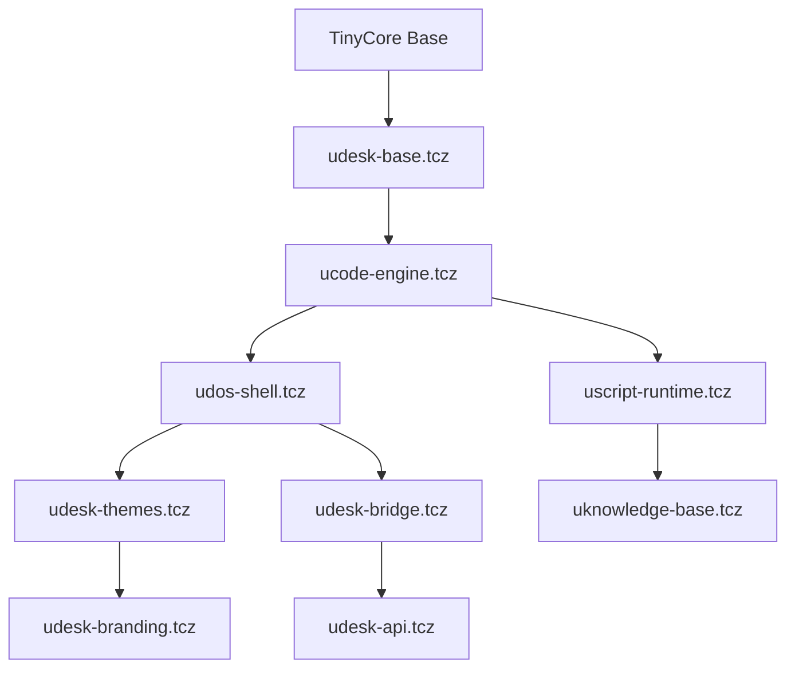

# uDESK v1.7 Extension Dependency Tree

## Architecture Overview
```
uDESK v1.7 = Tauri Wrapper + TinyCore Linux + Custom Extensions
```

## Load Order & Dependencies

### Level 0: TinyCore Base System
```
tinycore-base.iso
├── vmlinuz              # Linux kernel
├── core.gz              # Basic rootfs
└── boot/                # Boot configuration
```

### Level 1: Essential TinyCore Extensions (Official)
```bash
# Core system requirements (load first)
bash.tcz                 # Enhanced shell
ncurses.tcz             # Terminal library
readline.tcz            # Command line editing
coreutils.tcz           # Basic file utilities
util-linux.tcz         # System utilities
```

### Level 2: Development Tools (Official TinyCore)
```bash
# Development environment
gcc.tcz                 # Compiler collection
glibc-dev.tcz          # Development headers
make.tcz               # Build automation
git.tcz                # Version control
python3.9.tcz          # Python runtime
nodejs.tcz             # Node.js runtime
```

### Level 3: GUI & Display (Official TinyCore)
```bash
# X Window System
Xorg-7.7.tcz           # X server
Xfbdev.tcz             # Framebuffer driver
flwm.tcz               # Window manager
aterm.tcz              # Terminal emulator
```

### Level 4: Network & Connectivity (Official TinyCore)
```bash
# Networking stack
openssh.tcz            # SSH client/server
curl.tcz               # HTTP client
wget.tcz               # Download utility
rsync.tcz              # File synchronization
wifi.tcz               # Wireless networking
```

### Level 5: Text Editing & File Management (Official TinyCore)
```bash
# User tools
nano.tcz               # Text editor
mc.tcz                 # Midnight Commander
beaver.tcz             # GUI text editor
```

### Level 6: Custom uDESK Core Extensions
```bash
# uDESK foundation extensions (our custom .tcz files)
udesk-base.tcz         # Dependencies: bash.tcz, ncurses.tcz
├── usr/local/lib/udesk/
├── etc/profile.d/udesk.sh
└── usr/local/share/udesk/

ucode-engine.tcz       # Dependencies: udesk-base.tcz, bash.tcz
├── usr/local/bin/ucode
├── usr/local/lib/ucode/
└── usr/local/share/ucode/syntax/

udos-shell.tcz         # Dependencies: ucode-engine.tcz, readline.tcz
├── usr/local/bin/udos
├── usr/local/lib/udos/
└── usr/local/share/udos/themes/
```

### Level 7: uDESK Enhancement Extensions
```bash
# Visual and theme extensions
udesk-fonts.tcz        # Dependencies: udesk-base.tcz
├── usr/local/share/fonts/retro/
│   ├── c64.ttf
│   ├── mode7.ttf
│   ├── chicago.ttf
│   └── terminus.ttf
└── etc/fonts/conf.d/

udesk-themes.tcz       # Dependencies: udos-shell.tcz, udesk-fonts.tcz
├── usr/local/share/udos/themes/
│   ├── polaroid.sh
│   ├── c64.sh
│   ├── macintosh.sh
│   └── mode7.sh
└── usr/local/share/udesk/ascii/

udesk-branding.tcz     # Dependencies: udesk-themes.tcz
├── usr/local/share/udesk/boot/
├── usr/local/share/udesk/logos/
└── etc/issue.net
```

### Level 8: Advanced uDESK Extensions
```bash
# Advanced functionality
uscript-runtime.tcz    # Dependencies: ucode-engine.tcz, python3.9.tcz
├── usr/local/bin/uscript
├── usr/local/lib/uscript/
└── usr/local/share/uscript/stdlib/

uknowledge-base.tcz    # Dependencies: uscript-runtime.tcz, nodejs.tcz
├── usr/local/bin/uknowledge
├── usr/local/lib/uknowledge/
└── opt/uknowledge/

unetwork-tools.tcz     # Dependencies: openssh.tcz, curl.tcz
├── usr/local/bin/unetwork
├── usr/local/lib/unetwork/
└── usr/local/share/unetwork/tools/

udebug-tools.tcz       # Dependencies: gcc.tcz, gdb.tcz
├── usr/local/bin/udebug
└── usr/local/lib/udebug/
```

### Level 9: Tauri Bridge Extensions
```bash
# Container communication
udesk-bridge.tcz       # Dependencies: udos-shell.tcz, openssh.tcz
├── usr/local/bin/ubridge
├── usr/local/lib/ubridge/
└── etc/systemd/system/ubridge.service

udesk-api.tcz          # Dependencies: udesk-bridge.tcz, nodejs.tcz
├── usr/local/bin/uapi
├── usr/local/lib/uapi/
└── opt/uapi/web/
```

## Extension File Structure Standard

### Standard .tcz Extension Layout
```bash
extension-name.tcz/
├── DEBIAN/
│   ├── control          # Package metadata
│   └── postinst         # Post-installation script
├── usr/local/bin/       # Executables
├── usr/local/lib/       # Libraries
├── usr/local/share/     # Data files
├── etc/                 # Configuration
└── opt/                 # Optional components
```

### Dependencies File Format (.dep)
```bash
# udos-shell.tcz.dep
udesk-base.tcz
ucode-engine.tcz
bash.tcz
readline.tcz
ncurses.tcz
```

### Extension Information (.info)
```bash
# udos-shell.tcz.info
Title:          uDOS Shell
Description:    Enhanced terminal environment for uDESK
Version:        1.7.0
Author:         uDESK Project
Copying:        MIT License
Size:           2.1MB
Extension_by:   uDESK Team
Tags:           shell terminal uDOS
Comments:       Universal Device Operating System shell with uCODE support
Change-log:     First release for uDESK v1.7
Current:        1.7.0
```

## Boot Loading Sequence

### Phase 1: Core System
1. TinyCore kernel loads
2. Essential extensions mount
3. Basic filesystem setup

### Phase 2: uDESK Foundation
1. Load udesk-base.tcz
2. Load ucode-engine.tcz  
3. Load udos-shell.tcz
4. Initialize uDOS environment

### Phase 3: Enhancement Layer
1. Load theme extensions
2. Load font extensions
3. Apply user configuration
4. Start Tauri bridge

### Phase 4: User Environment
1. Launch uDOS shell
2. Display boot messages
3. Load user extensions
4. Ready for interaction

## Extension Build Dependencies

### Build Environment Requirements
```dockerfile
FROM tinycore/tinycore:latest

# Install build tools
RUN tce-load -wi compiletc.tcz
RUN tce-load -wi squashfs-tools.tcz
RUN tce-load -wi coreutils.tcz
RUN tce-load -wi bash.tcz

# Set up build environment
ENV TCZ_BUILD_DIR=/tmp/tcz-build
ENV TCZ_OUTPUT_DIR=/output
```

### Cross-Extension Dependencies


## Testing & Validation

### Extension Testing Pipeline
1. **Dependency Check**: Verify all .dep files are satisfied
2. **Installation Test**: Mount extension and check file placement
3. **Integration Test**: Verify extension works with dependencies
4. **Boot Test**: Ensure extension loads correctly during boot
5. **Functionality Test**: Validate core features work as expected

### Quality Gates
- All dependencies must be available in TinyCore repository or uDESK collection
- Extensions must follow TinyCore packaging standards
- File conflicts between extensions must be resolved
- Boot time impact must be minimized
- Memory footprint must be documented

This dependency tree ensures proper load order and maintains TinyCore compatibility while adding uDESK enhancements.
